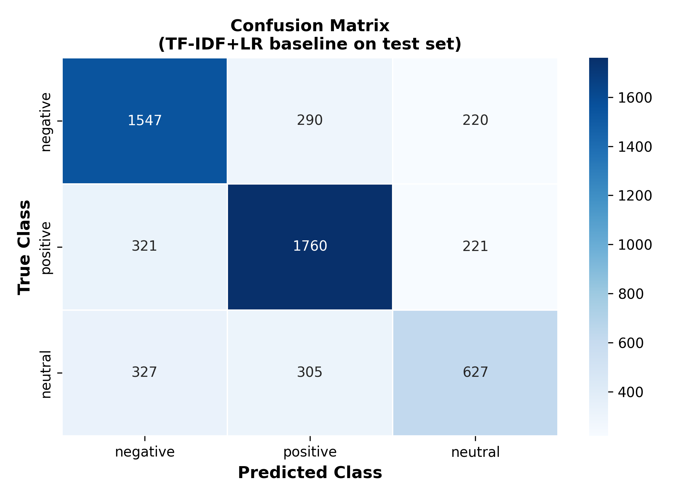
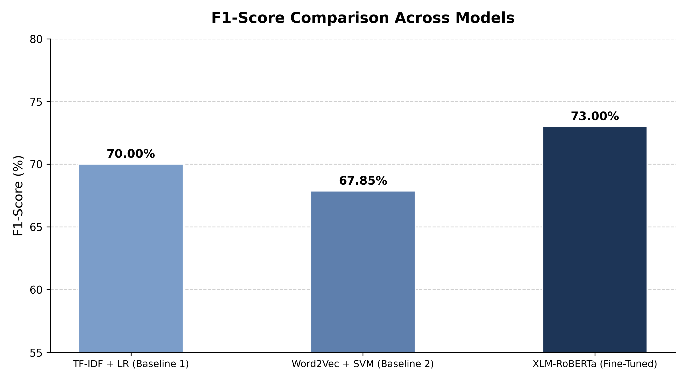

# NLP Research Project — Roman Urdu Sentiment Analysis

A comparative study of sentiment analysis approaches on **Roman Urdu** social media reviews, using classical machine learning baselines and a fine-tuned transformer model (XLM-RoBERTa). This work is accompanied by a full IEEE-format research paper.

---

## Overview

Roman Urdu (Urdu written in Latin script) is widely used across Pakistani social media but is severely under-resourced in NLP. This project benchmarks three models on a 3-class sentiment classification task (positive / negative / neutral):

| Model | Accuracy | Precision | Recall | F1-Score |
|---|---|---|---|---|
| TF-IDF + Logistic Regression (Baseline 1) | 70.02% | 69.58% | 70.02% | 69.69% |
| Word2Vec + SVM (Baseline 2) | 67.75% | 67.97% | 67.75% | 67.44% |
| **XLM-RoBERTa Fine-Tuned (Proposed)** | **73.05%** | **73.00%** | **73.00%** | **73.00%** |

---

## Repository Structure

```
nlp-research-project/
│
├── data/
│   └── Roman Urdu reviews Dataset with English translation.csv   # Raw dataset
│
├── clean_data.py                   # Data cleaning & preprocessing
├── cleaned_reviews.csv             # Preprocessed dataset (3-class labels)
│
├── train_baseline.py               # Baseline 1: TF-IDF + Logistic Regression
├── train_word2vec_svm.py           # Baseline 2: Word2Vec + SVM
├── train_xlm_roberta.py            # Proposed model: Fine-tuned XLM-RoBERTa
│
├── error_analysis.py               # Full error analysis script
├── generate_quick_error_analysis.py
├── generate_comparison.py          # Model comparison table generator
├── generate_paper_data.py          # Generates all numbers used in the paper
│
├── plot_cm_from_text.py            # Confusion matrix plot script
├── plot_f1.py                      # F1 comparison bar chart script
├── confusion_matrix.png            # Confusion matrix (XLM-RoBERTa)
├── f1_comparison.png               # F1-score comparison chart
│
├── baseline1_results.txt           # Evaluation results — Baseline 1
├── baseline2_results.txt           # Evaluation results — Baseline 2
├── proposed_model_results.txt      # Evaluation results — XLM-RoBERTa
├── model_comparison.csv            # Summary comparison table
├── error_analysis.csv              # Error analysis output
├── latex_comparison_table.txt      # LaTeX-ready results table
│
├── ieee_paper.tex                  # Full IEEE-format research paper (LaTeX)
├── Paper.pdf                       # Compiled research paper (PDF)
│
└── README.md
```

---

## Models

### Baseline 1 — TF-IDF + Logistic Regression
- Text vectorized with TF-IDF (top 5,000 features)
- Logistic Regression classifier (`max_iter=1000`)
- 80/20 train-test split (seed 42)

### Baseline 2 — Word2Vec + SVM
- Word2Vec embeddings (document-level average)
- SVM classifier
- Same train-test split for fair comparison

### Proposed Model — Fine-Tuned XLM-RoBERTa
- Pre-trained multilingual model: `xlm-roberta-base`
- Fine-tuned for 6 epochs, batch size 16, learning rate 2e-5
- Warmup ratio 0.1, weight decay 0.01
- Best checkpoint selected by weighted F1-score
- Outperforms both baselines on all metrics

---

## Setup & Usage

### 1. Clone the repository
```bash
git clone https://github.com/zohaib-7035/NLP-research-project.git
cd NLP-research-project
```

### 2. Create a virtual environment and install dependencies
```bash
python -m venv venv
source venv/bin/activate        # Windows: venv\Scripts\activate
pip install pandas scikit-learn gensim transformers torch
```

### 3. Run the pipeline

```bash
# Step 1 — Clean the raw data
python clean_data.py

# Step 2 — Train baselines
python train_baseline.py
python train_word2vec_svm.py

# Step 3 — Fine-tune XLM-RoBERTa (GPU recommended)
python train_xlm_roberta.py

# Step 4 — Generate plots and analysis
python plot_cm_from_text.py
python plot_f1.py
python error_analysis.py
```

> **Note:** Training XLM-RoBERTa is resource-intensive. A GPU (e.g., Google Colab with T4/A100) is strongly recommended. The script auto-detects Google Colab and saves checkpoints to Google Drive if available.

---

## Results

### Confusion Matrix (XLM-RoBERTa)


### F1-Score Comparison


---

## Research Paper

The full IEEE-format paper is available as [`Paper.pdf`](Paper.pdf). The LaTeX source is in [`ieee_paper.tex`](ieee_paper.tex).

---

## Author

**Zohaib Shahid**  
Data Science Student, FAST NUCES Lahore  
[zohaibshahid7035@gmail.com](mailto:zohaibshahid7035@gmail.com)
